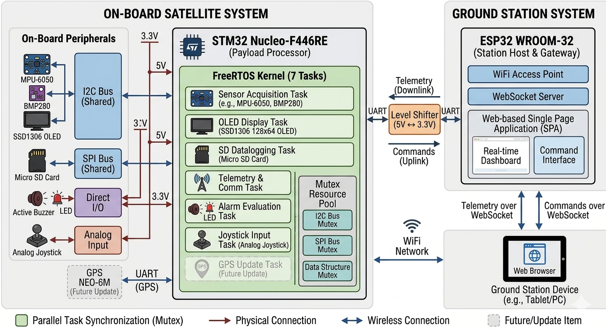
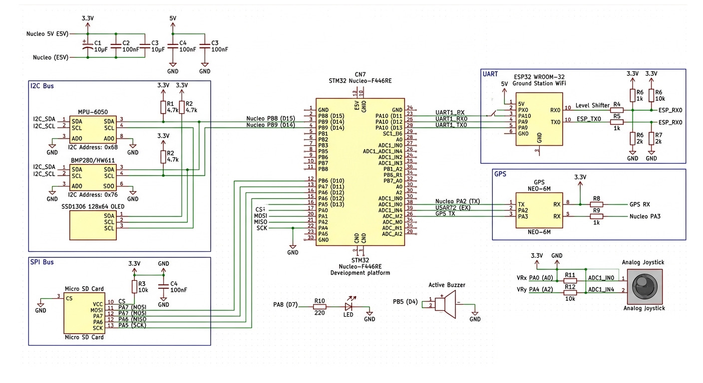
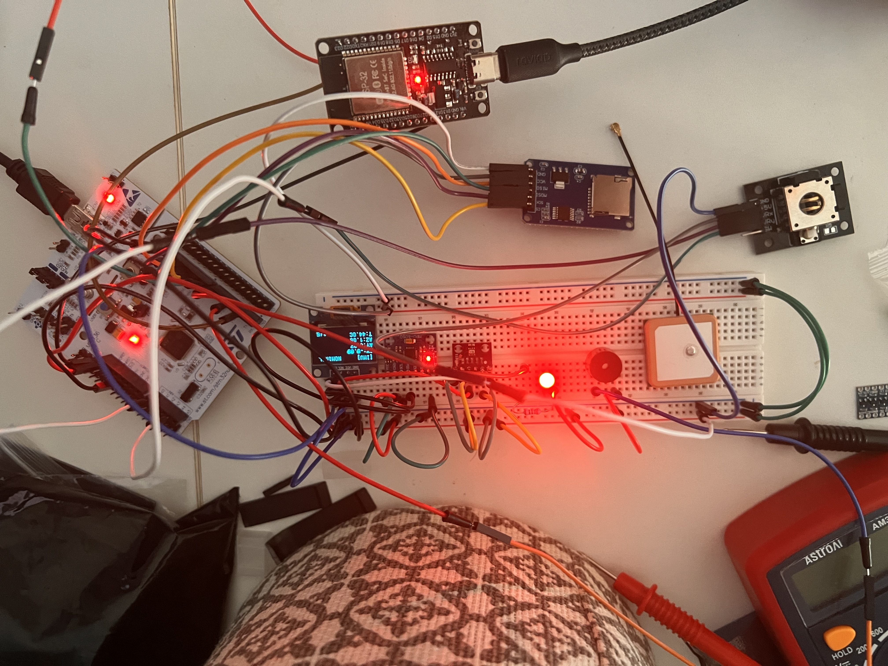
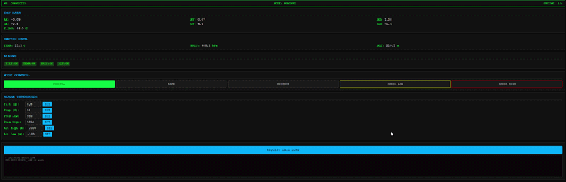

# Satellite Simulator

> [🇫🇷 Version française](../README.md)

A real-time satellite simulator built on an STM32F446RE (Nucleo) communicating with an ESP32 ground station over UART. The STM32 runs FreeRTOS with 8 concurrent tasks and reads real sensors (IMU, barometer) to simulate satellite subsystems. Sensor data is logged to an SD card as a black box, an OLED screen driven by joystick lets you navigate between views locally, and the ESP32 hosts a WiFi dashboard for remote monitoring and command.

---

## Table of Contents

- [Overview](#overview)
- [Hardware](#hardware)
- [Wiring](#wiring)
- [Software Architecture](#software-architecture)
- [Operational Modes](#operational-modes)
- [Web Dashboard](#web-dashboard)
- [Getting Started](#getting-started)
- [Project Structure](#project-structure)

---

## Overview

The idea behind this project is to reproduce, at small scale, the kind of architecture you find in a real satellite: multiple subsystems running concurrently, each with its own sampling rate, a shared data bus, alarm management, data logging, and a ground station link.

The **STM32** side handles all the "onboard" logic: sensor acquisition, alarm evaluation, OLED display, SD card logging, and telemetry output. It runs 7 FreeRTOS tasks with proper mutex synchronization on shared resources (I2C bus, SPI bus, sensor data structs). A GPS module is planned for a future update.

The **ESP32** acts as a ground station. It receives telemetry over UART, creates a WiFi access point, and serves a single-page web dashboard via WebSocket for real-time data visualization and command input.

<!-- TODO: add a high-level architecture diagram (e.g. STM32 <-> UART <-> ESP32 <-> WiFi <-> Browser) -->


---

## Hardware

### Components

| Component | Role |
|---|---|
| Nucleo-F446RE (STM32F446RET6) | Satellite simulator — runs FreeRTOS, reads sensors, manages subsystems |
| ESP32 DevKit | Ground station — WiFi AP, web server, command relay |
| MPU-6050 | 6-axis IMU (accelerometer + gyroscope), I2C |
| BMP280 | Barometric sensor (temperature, pressure, altitude), I2C |
| SSD1306 128x64 | OLED display, I2C |
| Analog joystick | 2-axis, used for OLED screen navigation and error acknowledgment |
| Micro SD card module | SPI, raw block logging (black box) |
| Buzzer (active) | Alarm feedback |
| LED | Heartbeat indicator (mode-dependent blink pattern) |

### Wiring

<!-- TODO: add the electrical schematic (Fritzing, KiCad, or hand-drawn) -->


**STM32 <-> ESP32 UART link:**

| STM32 Pin | ESP32 Pin | Signal |
|---|---|---|
| PA9 (USART1_TX) | GPIO16 (RX2) | Telemetry STM32 -> ESP32 |
| PA10 (USART1_RX) | GPIO17 (TX2) | Commands ESP32 -> STM32 |
| GND | GND | Common ground |

> The two boards have **separate power supplies**. Only GND is shared.

**STM32 peripherals:**

| Peripheral | Pins | Bus |
|---|---|---|
| MPU-6050 | PB8 (SCL), PB9 (SDA) | I2C1 |
| BMP280 | PB8 (SCL), PB9 (SDA) | I2C1 |
| SSD1306 OLED | PB8 (SCL), PB9 (SDA) | I2C1 |
| SD Card | PA5 (SCK), PA6 (MISO), PA7 (MOSI), PB6 (CS) | SPI1 |
| Joystick X | PA0 | ADC1_CH0 |
| Joystick Y | PA4 | ADC1_CH4 |
| Buzzer | PB5 | GPIO output |
| LED | PA8 | GPIO output |
| Debug UART | PA2 (TX), PA3 (RX) | USART2 |

<!-- TODO: add a photo of the real wiring / breadboard -->


---

## Software Architecture

### STM32 — FreeRTOS Tasks

The firmware runs on FreeRTOS (CMSIS-RTOS v2 API). All tasks run concurrently and share data through mutex-protected structs.

| Task | Priority | Description | Rate (Nominal / Science / Safe) |
|---|---|---|---|
| `Task_IMU` | AboveNormal | Reads MPU-6050 accelerometer, gyroscope, and die temperature | 20 Hz / 100 Hz / 5 Hz |
| `Task_BMP` | Normal | Reads BMP280 temperature, pressure, computes altitude | 2 Hz / 5 Hz / 0.5 Hz |
| `Task_Alarm` | AboveNormal | Evaluates alarm conditions (tilt, temp, pressure, altitude) and drives buzzer | 2 Hz (skipped in Safe) |
| `Task_Display` | Normal | Renders 5 OLED screens, handles joystick navigation and error acknowledgment | 10 Hz |
| `Task_Telemetry` | BelowNormal | Sends CSV telemetry on both UART2 (debug) and UART1 (to ESP32) | 5 Hz / 10 Hz / 1 Hz |
| `Task_ESP32` | Normal | Polls for incoming commands from ESP32 and processes them | 20 Hz |
| `Task_SDLog` | BelowNormal | Logs sensor data as raw 48-byte binary packets to SD card | 1 Hz |
| `DefaultTask` | Normal | LED heartbeat blink pattern + ERROR mode buzzer | Continuous |

**Shared resources and synchronization:**

Five mutexes protect concurrent access:
- `mutexIMU` / `mutexBMP` / `mutexAlarm` — sensor data structs
- `mutexI2C` — I2C1 bus (shared by IMU, BMP280, and OLED)
- `mutexSPI` — SPI1 bus (SD card)

### ESP32 — Ground Station

The ESP32 firmware is a single Arduino sketch. It:
1. Creates a WiFi access point (`SATELLITE_SIM`)
2. Serves an embedded HTML/CSS/JS dashboard on port 80
3. Maintains a WebSocket connection (`/ws`) for real-time bidirectional data
4. Forwards telemetry from STM32 UART to all connected WebSocket clients
5. Relays commands from the web UI back to the STM32

### Communication Protocol

**Telemetry (STM32 -> ESP32):** CSV over UART at 115200 baud.

```
AX,AY,AZ,GX,GY,GZ,T_IMU,T_BMP,P,ALT,JX,JY,ALARMS
```

**Commands (ESP32 -> STM32):** Plain text, newline-terminated.

```
CMD:MODE:NOMINAL
CMD:MODE:SAFE
CMD:MODE:SCIENCE
CMD:MODE:ERROR_LOW
CMD:MODE:ERROR_HIGH
CMD:ALARM:TILT:0.8
CMD:ALARM:TEMP:50.0
CMD:ALARM:PRES_LOW:950.0
CMD:ALARM:PRES_HIGH:1050.0
CMD:ALARM:ALT_HIGH:2000.0
CMD:ALARM:ALT_LOW:-100.0
CMD:DUMP
```

---

## Operational Modes

The satellite simulator has five operating modes that affect sensor sampling rates, LED behavior, and buzzer logic:

| Mode | LED Pattern | Buzzer | Sensor Rate | Notes |
|---|---|---|---|---|
| **Nominal** | 500ms blink | On (alarm-triggered) | Standard | Default operating mode |
| **Safe** | 2s slow blink | Disabled | Reduced | Low-power simulation, alarms skipped |
| **Science** | 100ms fast blink | On (alarm-triggered) | Maximum | High-frequency data acquisition |
| **Error Low** | Rapid blink | Short beeps | Standard | Requires joystick ack sequence (R-L-R) to clear |
| **Error High** | Solid ON | Continuous | Standard | Requires joystick ack sequence (R-L-R) to clear |

Modes can be changed remotely from the web dashboard or triggered locally. Error modes require a physical joystick acknowledgment sequence (Right -> Left -> Right) to return to Nominal.

### Alarm System

Four alarm conditions are monitored, each with configurable thresholds:

| Alarm | Default Threshold | Condition |
|---|---|---|
| Tilt | > 1.5 g | Accelerometer X or Y exceeds limit |
| Temperature | > 60 C | BMP280 temperature above limit |
| Pressure | < 900 or > 1100 hPa | Pressure out of expected range |
| Altitude | < -200 or > 3000 m | Altitude out of safe bounds |

All thresholds can be adjusted in real time from the web dashboard.

---

## Web Dashboard

The ESP32 serves a self-contained dashboard accessible by connecting to the `SATELLITE_SIM` WiFi network and navigating to `192.168.4.1`.

<!-- TODO: add a screenshot or GIF of the web dashboard in action -->


**Features:**

- **Real-time telemetry display** — IMU (6-axis accelerometer + gyroscope) and BMP280 (temperature, pressure, altitude) data streamed via WebSocket
- **Alarm status indicators** — Visual feedback with animated blinking when thresholds are exceeded
- **Remote mode control** — Switch between Nominal, Safe, Science, Error Low, and Error High modes from the web interface
- **Configurable alarm thresholds** — Adjust critical parameters in real time:
  - Tilt threshold (g)
  - Temperature limit (°C)
  - Pressure range (hPa, low/high)
  - Altitude bounds (m, low/high)
- **Error mode handling** — When an alarm threshold is exceeded, the satellite can automatically enter Error mode. The STM32 displays a dedicated error screen on the OLED, the buzzer emits continuous beeps (Error High) or short beeps (Error Low), and the operator must perform a physical joystick acknowledgment sequence (Right -> Left -> Right) to clear the error and return to Nominal mode.

<!-- TODO: add a GIF showing the error mode trigger from the website and joystick acknowledgment on the OLED -->


- **Data dump** — Request a full snapshot of current sensor values
- **Command log** — Real-time feedback of all commands sent to the STM32

---

## Getting Started

### Prerequisites

- [STM32CubeIDE](https://www.st.com/en/development-tools/stm32cubeide.html) (for the STM32 firmware)
- [Arduino IDE](https://www.arduino.cc/en/software) with ESP32 board support
- Arduino libraries: `ESPAsyncWebServer`, `AsyncTCP`

### Flashing the STM32

1. Open the `STM32_Simulator/` folder as an STM32CubeIDE project (or import the `.ioc` file).
2. Build the project.
3. Connect your Nucleo-F446RE via USB and flash.

### Flashing the ESP32

1. Open `ESP32_BaseStation/ESP32_BaseStation.ino` in Arduino IDE.
2. Install the required libraries (`ESPAsyncWebServer` and `AsyncTCP`) via the Library Manager.
3. Select your ESP32 board and COM port.
4. Upload.

### Running

1. Power both boards (USB or external supply). Make sure **GND is shared** between them.
2. Connect the UART lines (PA9 -> GPIO16, PA10 <- GPIO17).
3. On your phone or laptop, connect to the WiFi network `SATELLITE_SIM` (password: `sat12345`).
4. Open a browser and go to `http://192.168.4.1`.
5. You should see live telemetry data and be able to send commands.

<!-- TODO: add a short GIF or video showing the full workflow (boot -> dashboard -> mode change) -->


### OLED Navigation

Use the joystick to navigate between five display screens on the SSD1306:
1. **IMU** — Accelerometer values and IMU temperature
2. **BMP280** — Temperature, pressure, altitude
3. **Alarm** — Current alarm states
4. **Mode** — Active mode, buzzer status
5. **Status** — Sensor init status, joystick raw values

---

## Project Structure

```
.
├── ESP32_BaseStation/
│   └── ESP32_BaseStation.ino      # ESP32 ground station firmware
├── STM32_Simulator/
│   ├── Core/
│   │   ├── Inc/                   # Headers (main.h, ssd1306.h, FreeRTOSConfig.h, ...)
│   │   ├── Src/                   # Sources (main.c, ssd1306.c, freertos.c, ...)
│   │   └── Startup/               # Startup assembly
│   ├── Drivers/                   # HAL & CMSIS drivers
│   ├── Middlewares/               # FreeRTOS kernel
│   ├── Satelite.ioc               # STM32CubeMX project file
│   ├── STM32F446RETX_FLASH.ld    # Linker script (flash)
│   └── STM32F446RETX_RAM.ld      # Linker script (RAM)
└── README.md
```
### AI

Some illustration images (diagrams, schematics) were generated with **Gemini**. Real setup photos are authentic. **Claude** was used as a learning tool and for assistance on certain parts of the code.
---

Thanks for taking the time to look at this project. If you have any questions, suggestions, or just want to chat about it, feel free to open an issue or reach out. I hope this project can inspire you or be of use.


